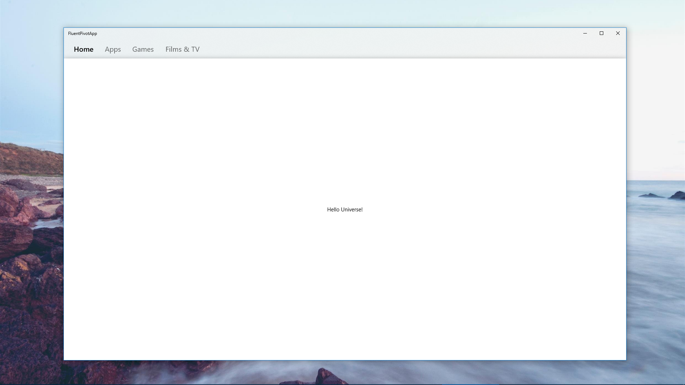

# FluentPivotApp

Update: The [WinUI NavigationView control](https://docs.microsoft.com/en-us/windows/uwp/design/controls-and-patterns/navigationview) provides this option now! (However you can't swipe between pages at the moment)

Example based on @navarro_mael 's Fluent Design Layout Medium Article

